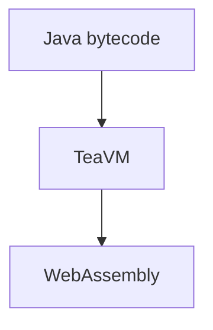

# Post syntax reference

Everything beyond plain Markdown that works in `src/content/blog/*.md`.

The pipeline is assembled in `astro.config.mjs` under `markdown.processor`:

```
remarkDirective → remarkGithubBlockquoteAlerts → remarkCanvasDemo → remarkTabs
```

plus the `astro-mermaid` integration. Styles for all of it live in
`src/styles/`, and tab behaviour in `src/scripts/tabs.ts`.

> [!IMPORTANT]
> Astro caches **rendered** Markdown in its content layer store
> (`node_modules/.astro/data-store.json`), and editing a remark plugin does not
> invalidate it. After changing anything in `src/plugins/`:
>
> - dev: `astro dev stop && astro dev --background`
> - build: `astro build --force` (`--force` clears the content cache; a plain
>   `astro build` will happily re-emit the previous render)
>
> Editing a _post_ is fine — that invalidates normally. This only bites when
> the plugin changed but the Markdown didn't.

---

## Frontmatter

Schema: `src/content.config.ts`. Missing or mistyped required keys fail the
build; unknown keys are silently dropped, so a typo'd field name just does
nothing.

| Field         | Type     | Default | Notes                                                    |
| ------------- | -------- | ------- | -------------------------------------------------------- |
| `title`       | string   | —       | **required**                                             |
| `description` | string   | —       | **required**, used for SEO/OG tags                       |
| `pubDate`     | date     | —       | **required**, e.g. `"Aug 29 2026"`                       |
| `updatedDate` | date     | —       | optional                                                 |
| `heroImage`   | image    | —       | path relative to the post, e.g. `"../../assets/foo.jpg"` |
| `showToc`     | boolean  | `true`  | renders `TableOfContents` in the sidebar                 |
| `tocMaxDepth` | number   | `3`     | deepest heading level shown in the TOC                   |
| `tags`        | string[] | `[]`    | each tag gets a `/tags/<tag>` page                       |
| `draft`       | boolean  | —       |                                                          |
| `hidden`      | boolean  | —       |                                                          |

```yaml
---
title: "AWTea, Part 2: Graphic Design is My Passion"
description: "The first cut of AWTea's renderer used the Canvas 2D API."
pubDate: "Aug 29 2026"
heroImage: "../../assets/graphic-design-is-my-passion.jpg"
draft: true
hidden: false
tags: ["java", "teavm", "awtea", "graphics"]
---
```

---

## Alerts (GitHub-style callouts)

A blockquote whose first line is `[!TYPE]`.

```markdown
> [!NOTE]
> AI was used in the design and implementation of AWTea.
```

Five types, case-insensitive: `NOTE`, `TIP`, `IMPORTANT`, `WARNING`, `CAUTION`.

| Type                  | Colour | Badge             |
| --------------------- | ------ | ----------------- |
| `NOTE`                | blue   | NOTE              |
| `TIP`                 | green  | TIP               |
| `IMPORTANT`           | red    | IMPORTANT         |
| `WARNING` / `CAUTION` | amber  | WARNING / CAUTION |

The plugin's default SVG icons are hidden by CSS — the uppercase text badge is
the whole look. Alerts are `width: fit-content` and centred, so keep the text
short; a long paragraph fills the column and reads like a regular blockquote.
Styles: `src/styles/alerts.scss`.

---

## Tabs

For screenshot comparisons, before/after prose, anything with a few variants.

```markdown
::::tabs
:::tab[Native AWT]


Runs on desktop Java, no browser involved.
:::

:::tab[Canvas2D]

:::
::::
```

The first tab is active on load. Panels take arbitrary Markdown — prose, images,
lists, even code fences.

**Colon count matters.** `remark-directive` picks the directive kind by how many
colons you use, and the wrong count fails _differently_ rather than loudly:

| Written as | Parsed as           | Result                        |
| ---------- | ------------------- | ----------------------------- |
| `:tabs`    | text directive      | build error from `remarkTabs` |
| `::tabs`   | leaf directive      | build error from `remarkTabs` |
| `:::tab`   | container directive | ✅ correct for a tab          |
| `::::tabs` | container directive | ✅ correct for the wrapper    |

The outer `tabs` needs **more** colons than its children so the parser can tell
the closing fences apart — the same rule as nesting a three-backtick fence
inside a four-backtick one. `remarkTabs` fails the build with a file-anchored
message if you use 1 or 2 colons, so a typo won't silently render as plain
paragraphs.

Tab keys are slugified from the label (`Native AWT` → `native-awt`). Duplicates
get a `-2` suffix and a build warning. To pin a key yourself:

```markdown
:::tab[Native AWT]{name="awt"}
```

Tabs are keyboard-navigable: <kbd>Tab</kbd> reaches the tab bar, then
<kbd>←</kbd>/<kbd>→</kbd>/<kbd>Home</kbd>/<kbd>End</kbd> move between tabs. The
plugin emits `role="tablist"`/`tab`/`tabpanel` and keeps `aria-selected` in sync,
so nothing extra is needed in a post.

Styles: `src/styles/tabs-container.scss` (shared chrome in `tabs-shared.scss`).
Behaviour: `src/scripts/tabs.ts`, loaded once by `BaseLayout.astro` and delegated
from `document` — every tab widget on the site runs off that one module, so
there is nothing per-post to wire up.

---

## Live canvas demos

A `js` fence whose meta string contains `live` and a `canvasId`:

````markdown
```js live canvasId="rect-canvas"
const canvas = document.getElementById("rect-canvas");
const ctx = canvas.getContext("2d");
ctx.fillStyle = "red";
ctx.fillRect(10, 100, 50, 200);
```
````

Renders a two-tab widget: **JavaScript** (the source, highlighted as normal) and
**Live Preview** (a `<canvas>` the snippet draws onto). Tab labels are fixed.

- `canvasId` is **required** — without it the block renders as a plain code
  block and logs a warning at build time. It must match the id the snippet looks
  up, and be unique on the page.
- The canvas is a fixed `300 × 320`.
- The snippet runs inside a `try`/`catch` IIFE at page load; errors go to the
  console, not the page. Nothing leaks to the global scope, so two demos can
  both declare `const ctx` without colliding.
- A literal `</script>` inside the snippet is escaped for you.

Styles: `src/styles/code-demo-tabs.scss`.

---

## Mermaid diagrams

A plain fence, no extra setup — the `astro-mermaid` integration handles it:

````markdown

````

The site pins mermaid's `dark` theme in `astro.config.mjs`.

---

## Footnotes

Standard GFM. Definitions can live anywhere; they're collected into a section at
the bottom of the post.

```markdown
'Drive-bys' were rather common[^drive-by], since the applet ran in a sandbox.

[^drive-by]:
    Java's plugin was blocked or restricted multiple times over
    the years.
```

Back-references get a `↩` link, and both the reference and the definition carry
`scroll-margin-top: 5rem` so the sticky header doesn't cover the target when you
jump. Inline `code` inside a footnote is scaled down automatically.
Styles: `src/styles/footnotes.scss`.

---

## Images

Use relative Markdown image syntax so Astro optimises them (resize, `webp`,
`width`/`height`, lazy loading):

```markdown

```

Files go in `src/assets/`. Something in `public/` is served as-is, unoptimised.

To centre one, wrap it in a raw `div` — **the blank lines are required**, or the
Markdown inside won't be parsed as Markdown:

```markdown
<div style="text-align: center;">


</div>
```

Images inside a tab panel are centred and rounded already; no wrapper needed.

---

## MDX-only: `<Alert>`

Rename a post to `.mdx` and you can import components. `src/components/Alert.astro`
is the component-flavoured alert, useful when you want a custom badge:

```mdx
import Alert from "../../components/Alert.astro";

<Alert type="warn" badge="HEADS UP">
  This bit changed in v2.
</Alert>
```

`type` is `info` | `warn` | `error` | `success` (default `info`); `badge`
defaults to the type name. It shares the `--info-*` / `--warn-*` / `--error-*` /
`--success-*` tokens in `src/styles/tokens.scss` with the Markdown alerts.
No post currently uses MDX (`using-mdx.mdx.example` is parked).
