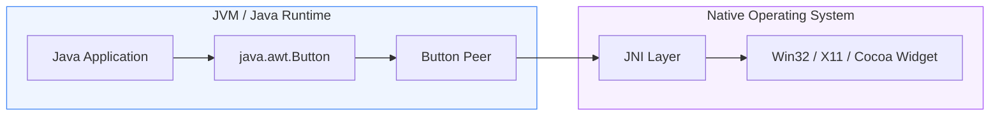
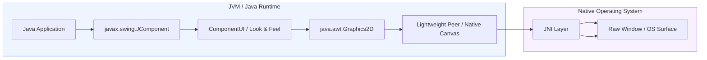

Hello! If you're reading this, congrats! You're one of the first to find this
series explaining how I brought AWT back to the browser. This post focuses
mainly on the background of AWT, Applets, and why it's such a pain to get
working in the native browser. Future posts will go into more depth, such as
rendering, input, sound, filesystems, and more!

## Background

Java Applets died years ago when modern browsers dropped NPAPI plugin support,
taking decades of desktop software and legacy games with them.

And it was the right call! Java was... Well to put it nicely, insecure. Java
'drive-bys' were rather common[^drive-by], since the applet was running in a
standalone JVM - a totally separate process from the browser, outside of all
standard browser sandboxing mechanisms. There were attempts to make it more
secure (such as disallowing a number of permissions that an unsigned applet
would have, and eventually blocking unsigned applets by default
completely[^unsigned-applets]) but the writing was on the wall. The browser
model had won and NPAPI was a liability.

With the death of plugins an incredible amount of early web history and
enterprise software tooling was effectively stranded. But the browser ecosystem
looks fundamentally different today. Most of what applets were used for now has
a native browser equivalent: the
[Canvas API](https://developer.mozilla.org/en-US/docs/Web/API/Canvas_API) for
rendering,
[Web Audio](https://developer.mozilla.org/en-US/docs/Web/API/Web_Audio_API) for
sound, even
[WebUSB](https://developer.mozilla.org/en-US/docs/Web/API/WebUSB_API) and
[WebSerial](https://developer.mozilla.org/en-US/docs/Web/API/Web_Serial_API) for
peripheral access[^firefox-web-apis].

And while those features are neat, they don't really address the _existing_
software that lives on only as applets. If the source is available, in theory
one could do a source port of it to JavaScript and make use of all those fancy
APIs... But that would require significant work, and potentially introduce other
bugs or issues that don't reflect the original applet's intention/design. And
that is only feasible if the source code to the applet is available in the first
place.

What if instead of rewriting line-by-line, you could target the existing JVM
bytecode and compile it to run inside the browser's sandbox itself?

[^drive-by]: Java's plugin was blocked or restricted by default multiple times
    over the years due to a steady stream of sandbox-escape vulnerabilities. As
    early as Java 7 Update 11 in January 2013, Oracle changed the plugin to stop
    running unsigned or self-signed applets automatically without user
    confirmation, in direct response to zero-click attacks using unsigned or
    self-signed applets being actively exploited in the wild.

[^unsigned-applets]: This happened with Java 7 Update 51, released January 2014,
    which raised the default security level to "High" and blocked unsigned
    applets outright rather than just warning about them. As of that release,
    unsigned Java applets are blocked by default, with no good workaround short
    of signing your code.

[^firefox-web-apis]: assuming you're not on
    [Firefox](https://mozilla.github.io/standards-positions) which is pickier
    about these, for privacy reasons.

### TeaVM

That is where [TeaVM](https://teavm.org/) enters the picture. TeaVM is an
ahead-of-time compiler that takes Java _bytecode_ (`.class` files) and
transpiles them into a number of different targets (WebAssembly and JavaScript
are the ones we use, but it can also target C.) What really sets it apart is the
fact that you don't need the original source code at all, you can take an
existing java class, feed it into TeaVM, and it will emit functionally
equivalent code. In addition, TeaVM (optionally) performs aggressive
optimizations on the code, such as dead-code removal, devirtualization[^devirt],
and more to yield remarkably small and fast artifacts.

[^devirt]: The act of taking a virtual method call and resolving it to a static
    call ahead of time, removing the dispatch overhead paid on every invocation.

### The AWT Gap

However TeaVM alone isn't enough to run a GUI application. It knows how to
translate the logic, and even portions of the runtime (thanks to their fantastic
[classlib](https://teavm.org/docs/runtime/java-classes.html) interop layer)
however the ability to run Swing and AWT programs is explicitly not a part of
TeaVM. konsoletyper (the core developer behind TeaVM) has said the following in
an [issue](https://github.com/konsoletyper/teavm/issues/406) requesting for
Swing and AWT support:

> First of all, AWT and Swing port can be made as a separate project. Just
> follow package naming convention and use `T` prefix[^teavm-t-prefix] (see
> `classlib` module) and this should work. Second, personally I'm too busy to
> maintain such a project. Third, I just don't see any purpose on porting Swing.
> [...] TeaVM is not focused on running existing Java, applications, it trades
> compatibility for efficiency.

That's fair, _more_ than fair really. Knowing what I know now about how deep the
AWT iceberg actually goes, I completely understand why it was outside the scope
of TeaVM core. But that didn't make the problem go away. I still had software to
save, and if TeaVM wasn't going to solve AWT, I'd have to.

My primary motivation was professional: I'd had a long-term client for whom,
years ago, I'd built several applets. One was a ~500-line applet that redacted
personal information from customer images, saving them from buying expensive
image-editing licenses for every machine. But for the other applets, the
original developers were long gone, the source code was lost, and the binaries
were heavily obfuscated. Porting my own code by hand was plausible... But
resurrecting the rest required an actual runtime. (There were a few of my
childhood-favorite games I wanted running again too, if I'm honest.)

[^teavm-t-prefix]: The `T` prefix in this context is how TeaVM implements
    classes that would normally be considered 'protected', like
    `java.lang.String` - at compile time TeaVM will look for classes like
    `java.lang.TString` and use it as a concrete implementation of a class
    instead. There is also similar functionality for working with packages, e.g
    re-writing `com.example.java.lang.TString` into `java.lang.String`.

### Why AWT Is Different

Before diving into the implementation, it helps to understand why AWT is such a
unique beast compared to modern web UI libraries, or even later Java frameworks
like Swing.

Designed in the mid-90s, AWT relied on an architecture built around
**heavyweight native peers**. When you instantiated a `java.awt.Button` or
`java.awt.TextField`, Java didn't draw pixels onto a surface. Instead, the JVM
invoked native C code via JNI to instantiate a real OS widget - an `HWND` on
Windows, a `Widget` on X11, or an `NSView` on macOS - and handed a native memory
handle back to Java. The `java.awt.Button` object was essentially just a remote
control for a widget owned by the operating system.

Standard Desktop AWT Flow:

Later on, Swing introduced 'lightweight' components, which rendered their own
pixels in Java. This addressed a number of headaches that you'd encounter with
AWT. A UI on one platform would look the same on another, unless the developer
explicitly override that with a native Look and Feel. But even then under the
hood Swing relies on AWT, every Swing window had to ultimately sit inside of an
AWT `Frame` or `Applet` - a root heavyweight peer.

Swing Flow:

Unfortunately, neither of these really map directly to a web-native API, so
that's something I needed to do myself.

## A Sneak Peek Into the Madness

> [!NOTE]
> **AWTea is not a full AWT implementation**. I was implementing classes needed
> for these applets to function. There are some extra (like `javax.sound.*`)
> that are also implemented, as I have a few games I wanted to get running. See
> [here](https://github.com/mdbell/awtea/blob/master/docs/coverage/report.md) to
> see what classes have implementations, as well as what portion(s) of it are
> implemented.

As neat as it'd be to walk through resurrecting that redaction applet, my client
would probably not appreciate me publishing their internal tooling on the open
internet. So you'll have to wait for later posts in this series to see AWTea
actually running something.

So you may be asking yourself, why did I bring up Swing there? Well, it's
because of the pragmatic approach that was taken when implementing it. And since
native peers aren't really a thing we'd be able to implement[^native-input], so
I just... chose not to. There _shouldn't_ be any real code out there relying on
the peer classes directly, unless they're doing some really really fun code; so
we don't need to either. We only need to model the **public** interface that
external code would use. `setVisible()`, `setLabel()`, `getLabel()`,
`addAPctionListener()`, etc. Everything under the hood is fair game.

That's the general strategy anyway - model the public contract, throw away
everything Sun assumed about native peers, and build something that actually
belongs in a browser. Actually pulling that off is a much longer story, and it
starts with the first thing any GUI needs before it can do anything else: a way
to put pixels on screen. That's where Part 2 picks up.

[^native-input]: In theory you _could_ try mapping them to native `<input ...>`
    elements, but that is an exercise I shall leave up to the reader.
