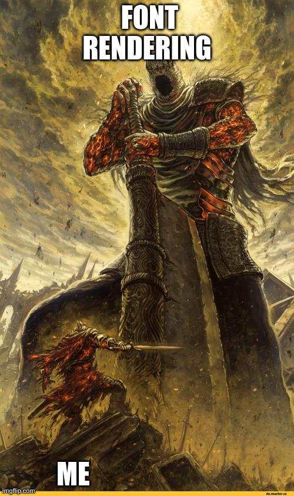

> [!NOTE]
> AI was used in the design and implementation of AWTea. While it was guided by
> myself, I acknowledge that may put some people off from my posts. I encourage
> you to continue reading however, as there were _many_ instances where I was
> fighting against it instead of passing work off onto it.

Welcome to part 2 of me explaining my descent into madness! I've iterated on the
graphics handling a few times now and... It's still not quite what I'd like.
I've over-engineered some aspects of it, and under-engineered others. We'll get
into that later though.

For this post, I've broken it down into essentially a timeline. Starting from
just 'getting it working' into its current state.

## Era 1: Canvas2D

If you're at all familiar with both the `java.awt.Graphics` class and HTML5
[CanvasRenderingContext2D](https://developer.mozilla.org/en-US/docs/Web/API/CanvasRenderingContext2D)
you may see a similarity or two.... Or three, or four. There's a number of
functions that map 1-1. See these two functionally the same code segments:

```java
import java.awt.*;

public class RectExample extends Component{

    @Override
    public void paint(Graphics g) {
        // Rectangle insides
        g.setColor(Color.RED);
        g.fillRect(10, 100, 50, 200);

        // Rectangle border
        g.setColor(Color.BLUE);
        g.drawRect(10, 100, 50, 200);
    }
}
```

And JavaScript:

```js live canvasId="rect-canvas"
const canvas = document.getElementById("rect-canvas");
const ctx = canvas.getContext("2d");
// Rectangle insides
ctx.fillStyle = "red";
ctx.fillRect(10, 100, 50, 200);

// Rectangle border
ctx.strokeStyle = "blue";
ctx.strokeRect(10, 100, 50, 200);
```

That single `paint()` call is a good demo, but it's not exactly a functioning
application. A `Component` doesn't paint itself onto the void. It needs to be
sitting in a `Frame`, which needs to be visible, which needs an event loop
telling it _when_ it can repaint. On the desktop all that plumbing is handled by
AWT's internals talking to the native windowing system. In the browser it's a
bit more complex. The `Frame` has to be mapped onto a `<canvas>`,
`requestAnimationFrame()` has to be used to drive repaints (more on this in a
later post when we get into the EventQueue - for now pretend we are rendering
inside its callback like in JS), and then a chain of calls translating "this
component is dirty, repaint it" into "call this component's `paint(Graphics g)`
with a `Graphics` backed by the canvas 2D context."

Once that chain existed, the Canvas2D mapping paid off fast. Very fast. It
wasn't just `fillRect` / `drawRect` - clipping regions mapped onto `ctx.clip`,
affine transforms mapped onto `ctx.setTransform()` - heck, even `drawImage()`
has a near equivalent in Canvas2D's `ctx.drawImage()`. For a while adding
support for a new `Graphics` method was less "design a rendering strategy" and
more "look up the Canvas2D equivalent and wire it through". Sure there were some
small quirks, like needing to set both the fill style and stroke style in every
`setColor()` call:

```java
public abstract class Canvas2DGraphics extends Graphics {

    protected Canvas2DContext ctx;
    private Color color;

    public void setColor(Color c) {
        // color -> #RRGGBB style syntax
        String name = ColorUtils.translateColor(c);

        this.ctx.setFillStyle(name);
        this.ctx.setStrokeStyle(name);

        this.color = c;
    }

    public Color getColor() {
        return this.color;
    }
}
```

However these were relatively small, and easy enough to get working. This was
the point where things started to feel finished. Rectangles were on screen, text
was drawn, images were showing up, and some layouts even functioned. Applets
that hadn't run in a browser in over a decade were suddenly rendering
pixel-for-pixel, more or less how they used to. It felt like the hard part was
over.

It wasn't.

## Era 2: Fonts - And Why They Suck.

<div style="text-align: center;">



</div>
